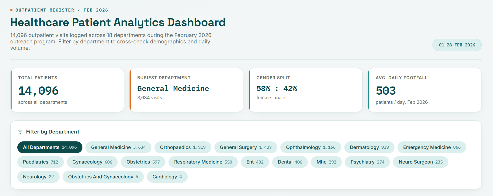
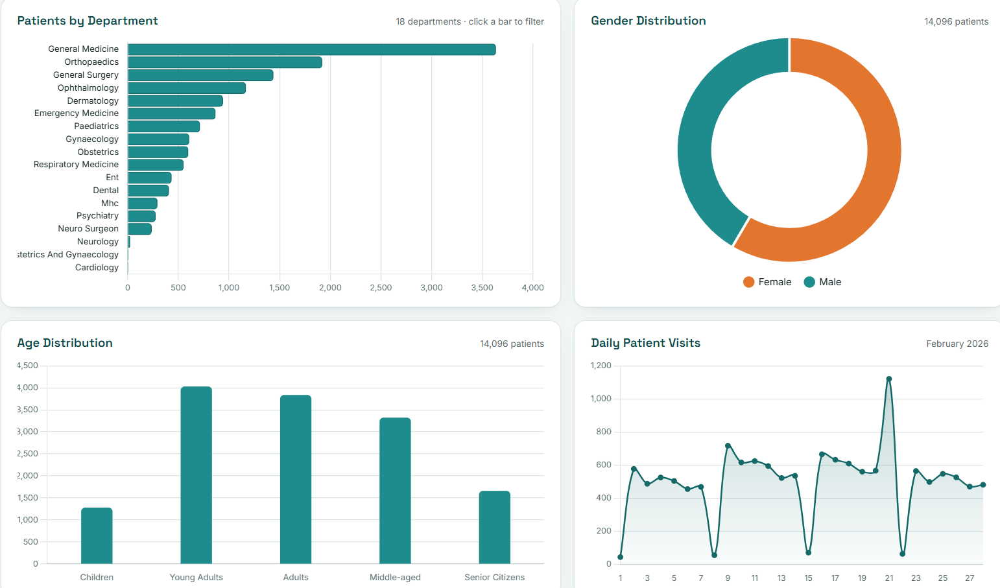

# Patient Analytics Dashboard

> This project was submitted as **"Medical Camp Data Analysis Dashboard"** in my resume. It's the same project and dataset, renamed for clarity since it's really about patient demographics and visit analytics rather than the camp setting itself.

An interactive dashboard analyzing 14,000+ patient registration records from a February 2026 outpatient camp, covering demographics, department-wise visits, and daily registration trends.

The original Power BI file (.pbix) is included in this repo — download it and open in Power BI Desktop to explore the full report, including the data model and DAX measures.

## Screenshots

### Dashboard Overview

### Charts & Visualizations

## Features
- **KPI cards** — total patients, departments, average age, busiest day
- **Department filter** — click any department bar to filter the whole dashboard live
- **Gender distribution** — donut chart
- **Age distribution** — bucketed into Children, Young Adults, Adults, Middle-aged, and Senior Citizens
- **Daily patient visits** — trend line across February 2026

## Tech
- Built as a single self-contained HTML file (Chart.js embedded, no external dependencies)
- Source data cleaned and transformed using Python/pandas
- A companion Power BI build guide is included in this repo for recreating the same dashboard as a `.pbix`

## Live demo
[View the dashboard](https://kanikasekar.github.io/Patient-Analytics-Dashboard/) 
## Skills demonstrated
Power BI · Microsoft Excel · Data Cleaning · Data Transformation · Data Visualization · Data Analysis
